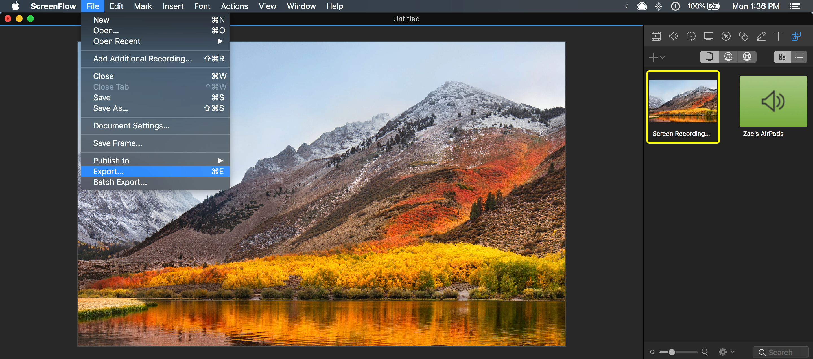
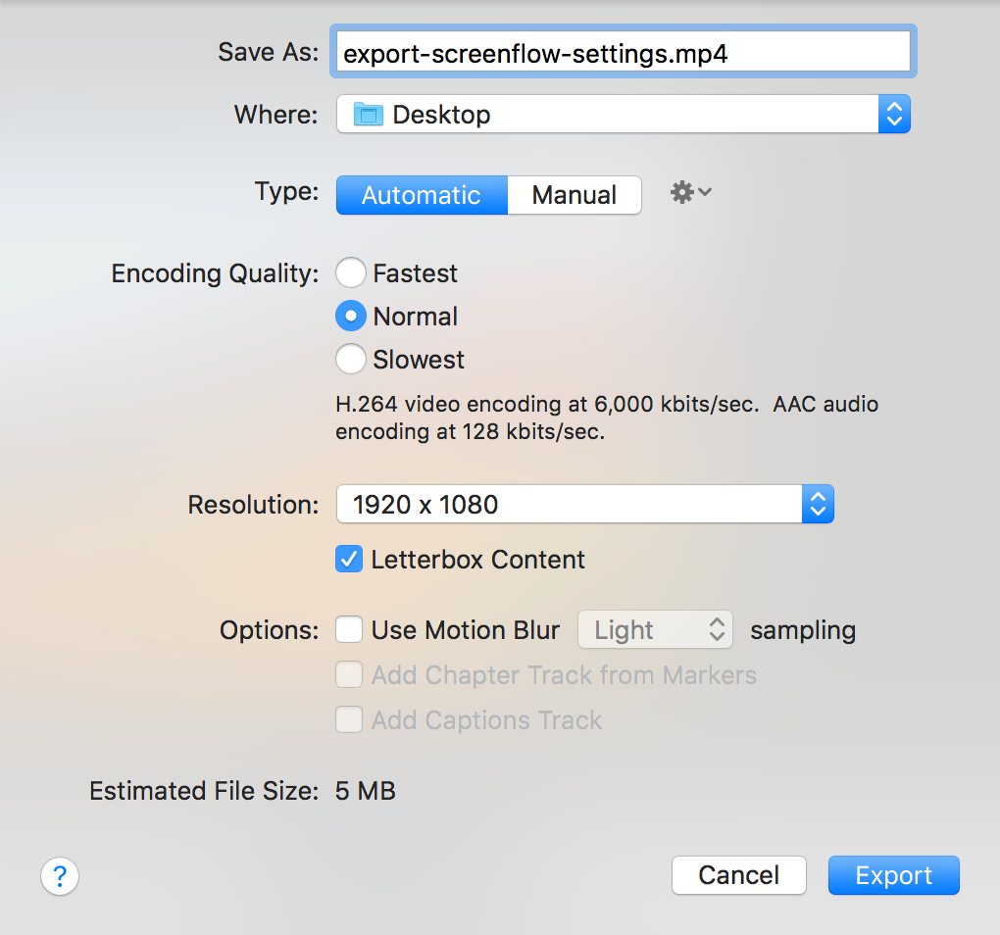
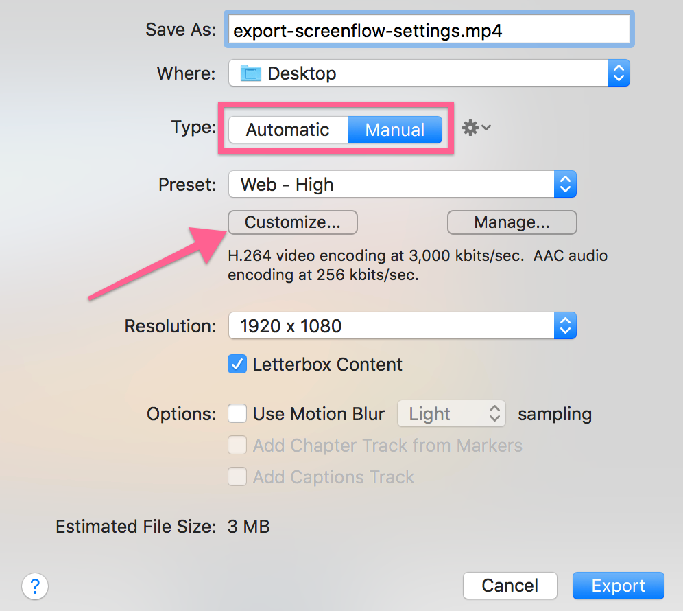
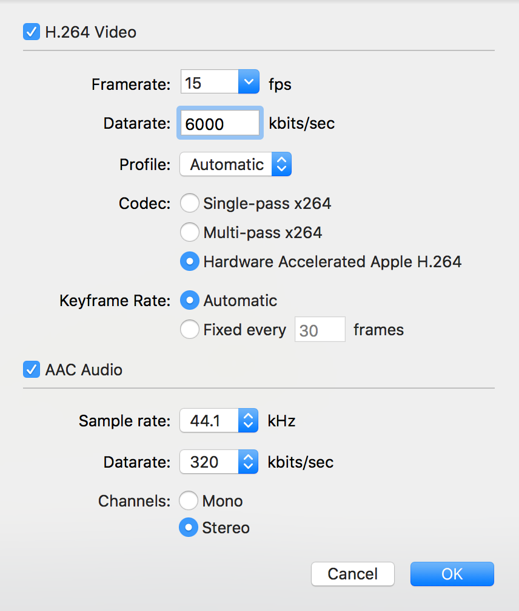
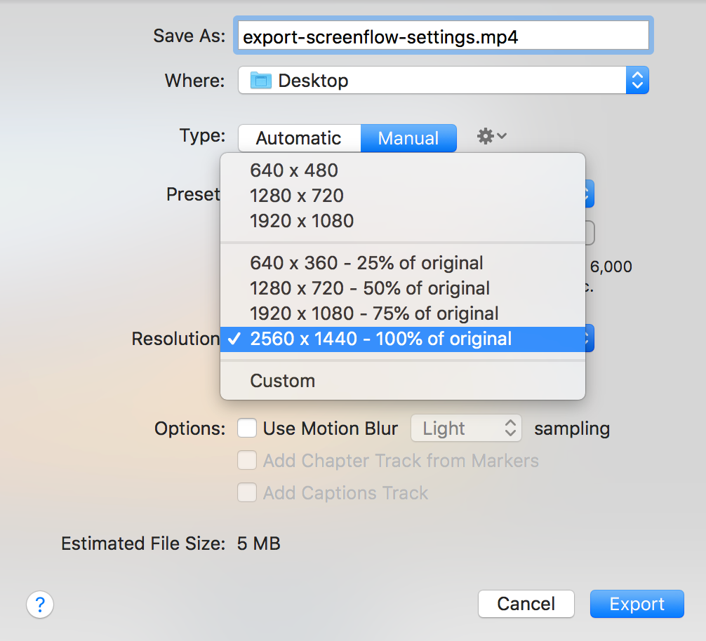
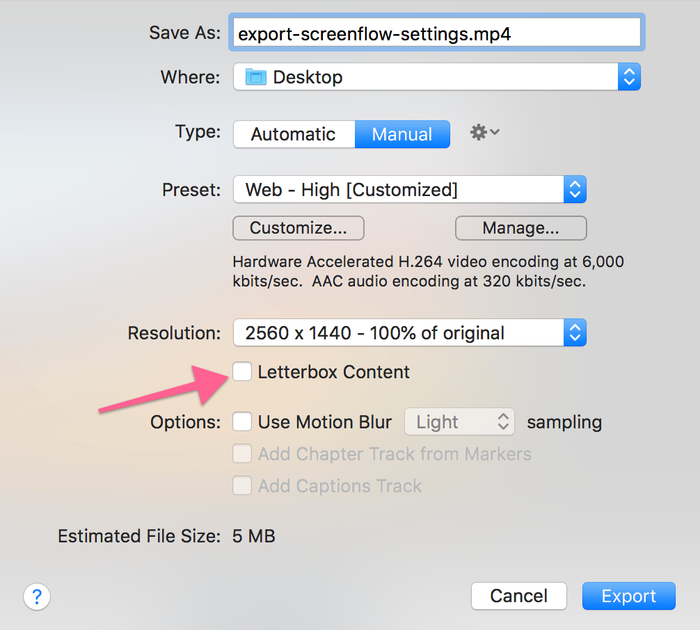
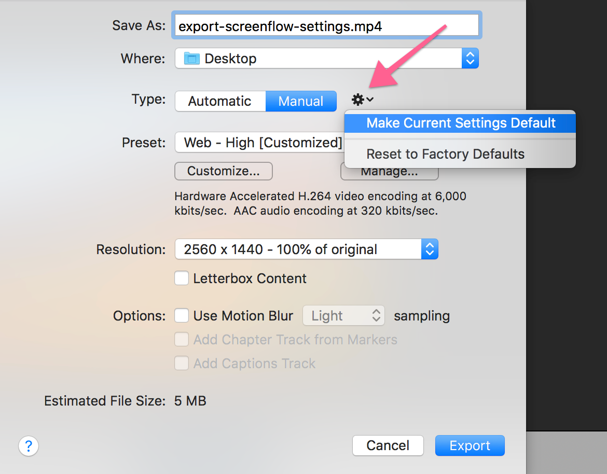

# Configure Screenflow Export Settings

Screenflow allows quite a bit of configuration while exporting videos. This configuration can be confusing as well as not work well with the post-production systems egghead put's the video file through.

To bring up the export interface, hit `cmd+E` or find the right button to click under the `File` dropdown close to the bottom: 

The following interface will be provided to you:

You will want to manually configure the settings for exports so switch the `Type` to `Manual` and click the `Customize...` button that appears under the dialog.

Set the `Framerate` to 15 fps which will work for most screencasts and reduces file size quite a bit. If you are doing animation you might want to bump up to 30 fps. `Datarate` 6000 kbits/sec and `Profile` to `Automatic`

Set `Codec` to `Hardware Accelerated Apple H.264` but `Single-pass x264` will also work. `Multi-pass x264` is slow.

For `ACC Audio`, bump up `Datarate` to 256 or 320, this will ensure the audio remains crispy. Set `Stereo` for `Channels` so will export for both speakers even if audio was recorded on one channel.

Set `Resolution` to 100% of the original. When Screenflow exports and scales, the result will be blurry. The video you upload will be processed by eggheads backend which corrects and shrinks the video file appropriately. 

The one consideration to make is the bandwidth that you are working on. Upload to the highest scale possible for you when bandwidth is limited.

And finally, uncheck `LetterBox Content`

To save these settings, hit the cog next to the `Type` and `Make Current Settings Default`.

